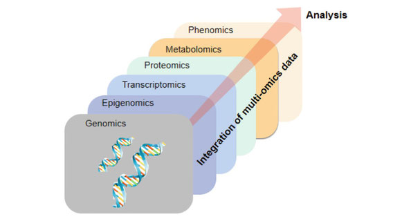

# Machine Learning for Multi-Omics Integration

## Instructor

- Dr. Nikolay Oskolkov, Lund University, NBIS SciLifeLab

## Course overview
Next-Generation Sequencing (NGS) technologies have led to the generation of vast amounts of biological and biomedical Big Data. The rapidly expanding volume and diversity of this data present both exciting opportunities and considerable challenges for analysis. Biological Big Data from various sources, often referred to as Multi-Omics data, hold great promise due to their synergistic effects, which can potentially model the behavior of biological cells. By integrating Omics data, we can uncover novel biological pathways that may not be detectable in individual Omics datasets alone. In this course, we will explore machine learning methods for integrating large biological datasets, combining both lectures and hands-on sessions.

## Target audience and assumed background
We assume some basic awareness of UNIX environment, as well as at least beginner level of R and / or Python programming.

## Learning outcomes
By completing this course, you will:

- Understand the basics of machine learning approaches to biological data analysis
- Gain an overview of bioinformatic tools and best practices for integrative Omics analysis
- Be able to design an integrative project and implement appropriate analysis methodologies
- Be able to choose the right tools and approaches to answer your specific research question
- Gain confidence in learning new methods needed to answer your research question

---

# Schedule

## Before the course

|Time   |Activity                                                           |Link                                                |
|-------|-------------------------------------------------------------------|----------------------------------------------------|
|~ 1 h|Recorded talk: __Omics Logic Symposium 2022__ |[Video](https://www.youtube.com/watch?v=Jrz6t3fbOCw)|
|~ 2 h  |Primer article: __Predicting type 2 diabetes via machine learning integration of multiple omics from humanpancreatic islets__|[PDF](articles/Multi_Omics_T2D_ScientificReports2024.pdf)                        |
|~ 1 h  |In case needed: __Recap on Unix__                                  |[Hands-on](command-line-basics.md)                  |

## Day 1 - 2 pm - 8 pm Berlin time

|Time     |Activity                         |Link                                                                             |
|---------|---------------------------------|---------------------------------------------------------------------------------|
|2 pm - 2.30 pm  | Course outline and practical info                                               |[Slides](slides/course-outline-and-practical-info.pdf)                         |
|2.30 pm - 4 pm  | Introduction to Multi-Omics data integration via Machine Learning: key concepts |[Slides](slides/MachineLearningOmicsIntegration_Oskolkov.pdf)                  |
|4.30 pm - 6 pm  | Feature selection: univariate vs. multivariate (LASSO, PLS) feature selection   |[Hands-on](practicals/OmicsIntegration_FeatureSelection.html)                  |
|6.30 pm - 8 pm  | Supervised Omics integration: mixOmics and DIABLO                               |[Hands-on](practicals/supervised_omics_integr_CLL.html)                        |

## Day 2 - 2 pm - 8 pm Berlin time

|Time     |Activity                       |Link                                                                                                           |
|---------|-------------------------------|---------------------------------------------------------------------------------------------------------------|
|Morning  |Questions from the previous day|[Flinga](https://flinga.fi/s/FFQ5876)                                                                          |
|Morning  |QC and trimming                |[Slides](Lectures/QC-and-trimming.pdf) / [Hands-on](exercises.md#qc-and-trimming)                              |
|Afternoon|Read-based taxonomic profiling |[Slides](Lectures/read-based-taxonomic-profiling.pdf) / [Hands-on](exercises.md#read-based-taxonomic-profiling)|

## Day 3 - 2 pm - 8 pm Berlin time

|Time     |Activity|Link|
|---------|--------|----|
|Morning  |Questions from the previous day||
|Morning  |Metagenome assembly            |[Slides](Lectures/Assembly-and-QC.pdf) / [Hands-on](exercises.md#metagenome-assembly)  |
|Afternoon|Assembly & Assembly QC         |[Hands-on](exercises.md#assembly-qc)                                                   |
|Afternoon|Long reads & long read assembly|[Slides](https://docs.google.com/presentation/d/1F8D3QLJ1gqlWYrwO6W6zxG067QOcOF5EIHfTsTcH3G0/edit?usp=sharing) / [Hands-on](exercises.md#assembling-long-reads-with-flye)                               |

